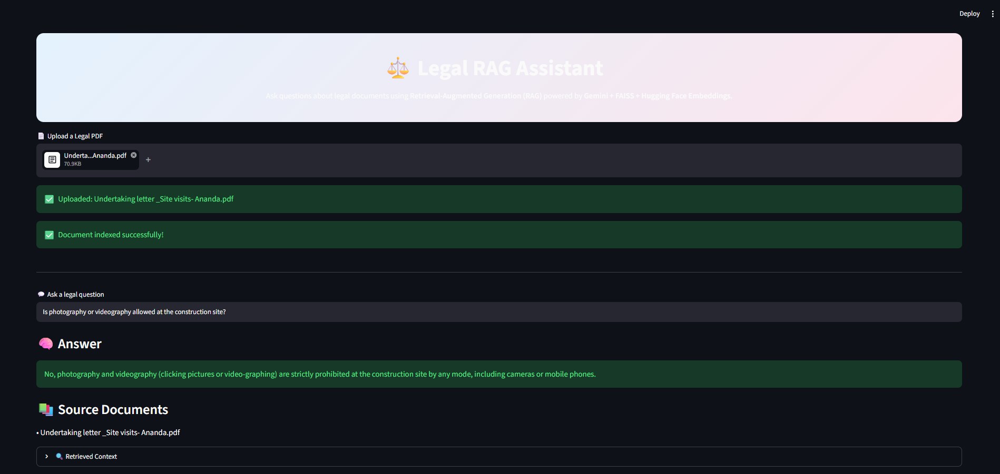

# ⚖️ Legal RAG Assistant

A Retrieval-Augmented Generation (RAG) assistant for analyzing legal PDF documents and answering questions using AI. Built with Streamlit, LangChain, FAISS, Hugging Face Embeddings, and Google Gemini.

## Setup Instructions

### Clone the repository

```bash
git clone https://github.com/Raj11Gupta/legal-rag-assistant.git
cd legal-rag-assistant
```

### Create a virtual environment

```bash
python -m venv myenv
```

### Activate the virtual environment

**Windows**
```bash
myenv\Scripts\activate
```

**macOS/Linux**
```bash
source myenv/bin/activate
```

### Install dependencies

```bash
pip install -r requirements.txt
```

### Set up environment variables

Create a `.env` file and add your Google Gemini API key:

```text
GOOGLE_API_KEY=your_api_key
```

### Run the Streamlit app

```bash
streamlit run app.py
```

Open the app at: `http://localhost:8501`

## Final Project UI

Below is a screenshot of the Legal RAG Assistant interface:


